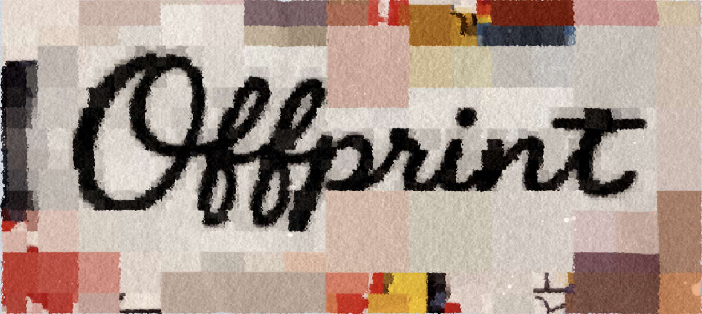

<p align="center">
  
</p>

# Offprint V0.1

*Offprint* *(noun)*: a reprint of an article that originally appeared as part of a larger publication.

This repository catalogs law review journals and gathers downloadable PDFs for personal use.

`875 domains tracked` | `112,264 PDFs landed` | `W&L Top-50: 48/50`

`Seed -> Crawl -> PDF -> Footnotes/Text -> Dataset`

## Start In 10 Seconds

```text
/onboard-journal https://example.edu/law-review/
```

Run this in Claude Code. If you omit the URL, the skill can pick the next unonboarded journal from the registry.

Skill reference: [docs/skills/onboard-journal.md](docs/skills/onboard-journal.md)

## Project Goals

- Expand high-quality coverage across U.S. law review hosts.
- Keep scraping runs reproducible, resumable, and evidence-backed.
- Produce article-grade PDF, text, and footnote outputs for downstream research.
- Prefer conservative filtering over false-positive article inclusion.

## Coverage So Far

As of **March 31, 2026** (`python3 scripts/reporting/site_status_report.py --summary`) and Top-50 evidence as of **March 26, 2026** (`artifacts/top50_coverage_report_20260326_rerun.json`):

| Metric | Value |
|---|---:|
| Total known domains | 875 |
| Total PDFs on disk | 112,264 |
| Domains with adapter mapping | 92 |
| Domains with landed PDFs | 350 |
| Active sitemap domains | 523 |
| Paused domains (`paused_*`) | 255 |
| `todo_adapter` domains | 10 |
| W&L Top-50 landed coverage | 48 / 50 |
| W&L Top-50 non-DC missing | 0 |

## Document Processing

1. Quarantine non-article PDFs (high-precision QC):

```bash
python scripts/qc_quarantine_pdfs.py \
  --pdf-root artifacts/pdfs \
  --quarantine-root artifacts/quarantine \
  --dry-run false
```

2. Extract footnotes and article text:

```bash
python scripts/extract_footnotes.py \
  --pdf-root artifacts/pdfs \
  --features legal \
  --respect-qc-exclusions true

python scripts/extract_text_jsonl.py \
  --pdf-root artifacts/pdfs \
  --respect-qc-exclusions true
```

More detail: [docs/FOOTNOTE_QC_WORKFLOW.md](docs/FOOTNOTE_QC_WORKFLOW.md) and [scripts/README.md](scripts/README.md).

## Footnote Extraction Quality

We use a Dynamic Programming (DP) sequence solver over LiteParse layouts to extract ordinal footnote streams. 

As of **April 25, 2026**, the pipeline achieves high-fidelity extraction on standard text-based PDFs. Benchmarks on a 1k random sample (v3) show:

| Metric | LiteParse Only | Roadmap (w/ OCR) |
|---|---|---|
| **Articles Identified** | 672 / 1000 | 672 / 1000 |
| **Strict-Valid (Honest)** | **84.2%** | **~95% (Est.)** |
| **Valid with Gaps (Honest)** | **87.8%** | **~98% (Est.)** |
| **Empty (Image-only)** | 6.5% | < 1% |
| **Invalid (Garbled/OCR)** | 5.7% | < 2% |

*Honest Denominator:* Only includes documents identified as "articles" by `doc_policy` (excludes mastheads, TOCs, transcripts, and agendas).

### The OCR Frontier
The remaining ~12% of failures are primarily:
1. **Empty (6.5%):** Image-only scans (e.g. old volumes or scanned submissions) with zero text.
2. **Invalid (5.7%):** Existing OCR scans with highly garbled text that LiteParse cannot reliably parse.

**Next Step:** Route these documents through the `olmOCR/vLLM` pipeline to rescue the remaining scanned articles.

## Disclaimer

This project is for scholarly research workflows. Respect publisher terms and `robots.txt`, apply polite request behavior, and do not redistribute PDFs without verifying rights.

## Full Documentation

- Long-form overview moved from README: [docs/PROJECT_OVERVIEW.md](docs/PROJECT_OVERVIEW.md)
- Documentation index: [docs/README.md](docs/README.md)
