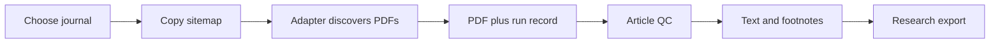

<p align="center">
  
</p>

<h1 align="center">Offprint</h1>

<p align="center">
  Find law journals, download article PDFs, and extract research-ready text and footnotes.
</p>

<p align="center">
  <a href="https://github.com/dbateyko/offprint/actions/workflows/quality.yml"></a>
  <a href="./LICENSE"></a>
  <a href="https://www.python.org/"></a>
</p>

| Explore | What you will see |
|---|---|
| **[Browse 2,600 known journals](docs/generated/JOURNAL_CATALOG.md)** | Journal, host, platform, readiness, and crawl configuration |
| **[See downloaded holdings by journal](docs/generated/HOLDINGS_BY_JOURNAL.md)** | 90,873 deduplicated PDF records grouped by journal or inferred collection |
| **[Understand the inventory](docs/INVENTORY.md)** | What “known,” “downloaded,” “article,” and “parsed” mean |

Offprint is a Python package plus a versioned journal catalog. It routes each journal to an
appropriate scraper, records every download and failure, then applies document QC and parsers
for text, metadata, citations, and ordinal footnotes. PDFs and derived corpus files stay local.

## Scrape and Parse One Journal

### 1. Install

```bash
git clone https://github.com/dbateyko/offprint.git
cd offprint
python3 -m venv .venv
source .venv/bin/activate
python -m pip install -e '.[dev]'
make doctor
```

### 2. Pick a Journal

Open the [journal catalog](docs/generated/JOURNAL_CATALOG.md), find a configured journal, and
copy its sitemap into a small working set. This example uses the Administrative Law Journal:

```bash
mkdir -p artifacts/quickstart/seeds
cp offprint/sitemaps/aalj-org.json artifacts/quickstart/seeds/
```

### 3. Download One PDF

The smoke runner downloads exactly one validated PDF per site, making it the safe first
acquisition command:

```bash
python scripts/pipeline/smoke_one_pdf_per_site.py \
  --sitemaps-dir artifacts/quickstart/seeds \
  --out-dir artifacts/quickstart/pdfs \
  --report-dir artifacts/quickstart/runs \
  --max-workers 1 \
  --max-depth 1 \
  --limit 1
```

Collection touches third-party sites. Review the seed, source terms, `robots.txt`, and request
settings before running it; keep concurrency conservative and honor backoff signals.

### 4. Parse It

Install the larger layout/OCR dependency set, then extract text and footnotes without OCR:

```bash
python -m pip install -e '.[pdf_footnotes]'

python scripts/processing/extract_text_jsonl.py \
  --pdf-root artifacts/quickstart/pdfs \
  --output-jsonl artifacts/quickstart/article_text.jsonl \
  --doc-policy article_only \
  --limit 1

python scripts/processing/extract_footnotes.py \
  --pdf-root artifacts/quickstart/pdfs \
  --features legal \
  --ocr-mode off \
  --doc-policy article_only \
  --limit 1
```

The parsers write JSONL reports and per-PDF sidecars. Image-only PDFs are flagged for a
separate OCR pass rather than silently counted as successful native extraction.

## What You Actually Need

An onboarding user can ignore most of the repository at first:

| Path | Why you need it |
|---|---|
| `data/registry/lawjournals.csv` | Search the known journal universe |
| `offprint/sitemaps/` | Select the journal targets to run |
| `offprint/adapters/` | Scraper implementations and host routing |
| `scripts/pipeline/` | Download, smoke, resume, and retry commands |
| `scripts/processing/` | PDF QC, text, metadata, OCR, and footnote commands |
| `artifacts/` | Your local PDFs, run records, reports, and parser outputs |

`tests/`, `scripts/quality/`, `scripts/research/`, `data/reference/`, and `scripts/archive/`
support maintainers and research evaluation. They are not required to scrape and parse a first PDF.
See [Repository Layout](docs/REPO_LAYOUT.md) for the complete map.

## Inspect Your Own Holdings

After running Offprint, generate a per-journal Markdown summary and an article-level CSV:

```bash
make holdings
```

This writes:

- `artifacts/reports/HOLDINGS_BY_JOURNAL.md`: counts, titled records, year ranges, and hosts;
- `artifacts/reports/article_holdings.csv`: journal, title, authors, year, URL, local path, and
  SHA-256 for each deduplicated successful PDF record.

The committed [holdings snapshot](docs/generated/HOLDINGS_BY_JOURNAL.md) shows the current
operator corpus at a glance. It is intentionally separate from the reproducible
[journal catalog](docs/generated/JOURNAL_CATALOG.md).

## How the Pieces Fit



For corpus-scale work, use the resumable production commands in [Operations](docs/OPERATIONS.md).
For scraper changes, read [Adapter Development](docs/ADAPTER_DEVELOPMENT.md).

## Documentation

| Need | Guide |
|---|---|
| Inventory and terminology | [Inventory](docs/INVENTORY.md) |
| System and artifact contracts | [Architecture](docs/ARCHITECTURE.md) |
| Production, resume, and recovery | [Operations](docs/OPERATIONS.md) |
| Every maintained command | [Script Catalog](scripts/README.md) |
| First code contribution | [Contributor Start](docs/CONTRIBUTOR_START_HERE.md) |
| Data and redistribution rules | [Data and Release Policy](docs/DATA_AND_RELEASE_POLICY.md) |
| All documentation | [Documentation Index](docs/README.md) |

## Responsible Use

Offprint is for scholarly research workflows. Respect publisher terms, access controls,
copyright, and `robots.txt`; identify your client appropriately; keep request rates polite;
and do not redistribute collected documents without verifying rights.
