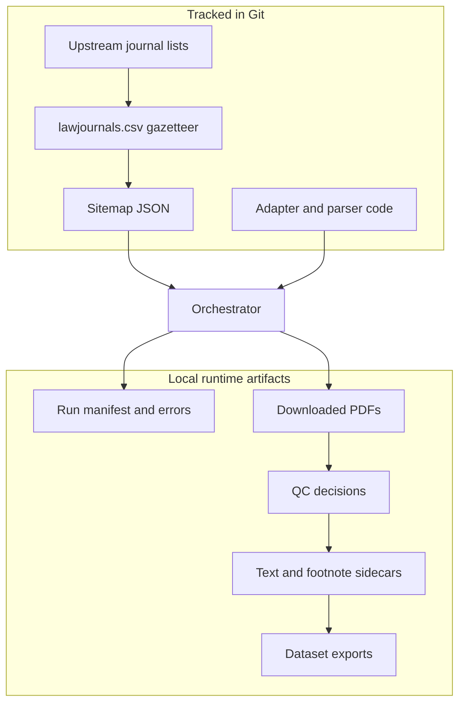

# Architecture

## System Boundary

Offprint is the public acquisition and document-processing package. Its reproducible inputs
are source code, journal-registry CSVs, and sitemap JSON. Its runtime products are local run
records, PDFs, parse sidecars, and exports.

The optional private data-operations workspace consumes exports and may combine them with
other collections. It does not define public scraper or parser behavior.

## Components

| Layer | Primary modules | Responsibility |
|---|---|---|
| Gazetteer | `data/registry/`, `offprint/gazetteer.py` | Journal identity, host, platform, provenance, lifecycle reporting |
| Seed catalog | `offprint/seed_catalog.py`, `offprint/sitemaps/` | Normalize crawl entry points and seed metadata |
| Routing | `offprint/adapters/registry.py`, `config/adapters.yml` | Select platform or host-specific discovery logic |
| Acquisition | `offprint/orchestrator.py`, `offprint/adapters/` | Discover candidates, download, retry, and record provenance |
| Network policy | `offprint/polite_requests.py`, `offprint/http_cache.py` | Delay, retry, caching, validation, and request evidence |
| Document policy | `offprint/pdf_footnotes/doc_policy.py` | Distinguish articles, frontmatter, compilations, and OCR needs |
| Parsing | `offprint/pdf_footnotes/`, `scripts/processing/` | Extract text, metadata, citations, and ordered notes |
| Quality | `scripts/quality/`, `tests/` | Fixtures, gold scoring, diagnostics, and repository gates |
| Reporting | `scripts/reporting/` | Tracked gazetteer and local corpus/run summaries |

## Acquisition Lifecycle

1. Build or refresh `data/registry/lawjournals.csv` from versioned upstream snapshots.
2. Create a sitemap JSON for a journal or journal sub-publication.
3. Resolve its host to a platform or site-specific adapter.
4. Discover article candidates and validate PDF responses.
5. Write an immutable run directory with records, errors, and statistics.
6. Resume the run or replay retryable failures without discarding prior evidence.

A lifecycle status describes the state of a registry or sitemap entry. It is not evidence of
a successful download. Missing sitemap status is currently interpreted as legacy inferred
`active`; see [Gazetteer and coverage](GAZETTEER.md) for the full vocabulary and caveats.

## Run Contract

Each canonical run lives at `artifacts/runs/<run_id>/` and can contain:

| File | Role |
|---|---|
| `manifest.json` | Run configuration and identity |
| `records.jsonl` | Successful discovery/download records with provenance |
| `errors.jsonl` | Structured failures for diagnosis and retry |
| `stats.json` | Aggregate and per-domain run accounting |

PDFs normally live under `artifacts/pdfs/<host>/`. HTTP snapshots, retry queues, smoke
outputs, parse sidecars, and exports also remain under `artifacts/`. These paths are
gitignored and must not be treated as versioned release data.

## Document Lifecycle

1. Validate that the file is a PDF and associate available acquisition metadata.
2. Apply document policy and high-precision QC exclusions.
3. Extract a native layout/text candidate.
4. Segment article body and ordinal note streams.
5. Route image-only or unreliable documents to optional OCR.
6. Persist per-document evidence and aggregate quality reports.

Parser quality is reported against explicit denominators. Non-articles, image-only scans,
and parser failures should not be collapsed into a single success percentage.

## Extension Points

- Add journal coverage with a sitemap when an existing adapter already fits.
- Add host-specific routing for isolated behavior.
- Change a shared adapter only with target and neighboring-family regression fixtures.
- Add parser heuristics behind document signals and protect them with real-layout fixtures.
- Add research exports downstream of canonical records rather than scraping around the run
  manifest.

See [Adapter development](ADAPTER_DEVELOPMENT.md), the [script catalog](../scripts/README.md),
and [data and release policy](DATA_AND_RELEASE_POLICY.md) before changing these boundaries.
