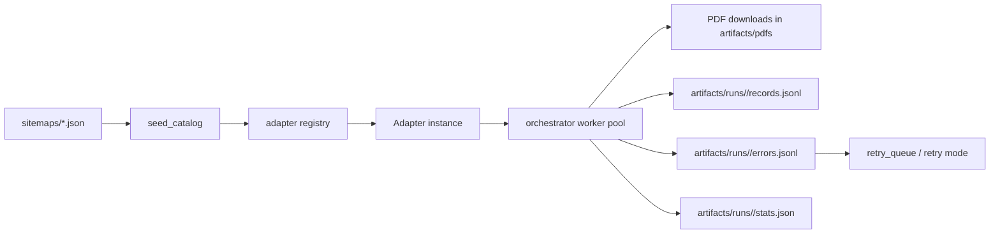

# Architecture

## Overview
The scraper is built around a platform adapter model with one orchestration entrypoint.

Core modules:
- `offprint/orchestrator.py`: run lifecycle, worker scheduling, artifact writing.
- `offprint/adapters/`: discovery and download strategies by platform/site.
- `offprint/seed_catalog.py`: sitemap loading, status filtering, seed context.
- `offprint/polite_requests.py`: request session with delay/retry/snapshot support.
- `offprint/http_cache.py`: TTL + size-capped provenance cache.
- `offprint/retry_queue.py`: persisted failure replay.
- `offprint/coverage_tools/`: coverage/completeness checks.

## Runtime Diagram

## Adapter Model
`Adapter` implementations expose:
- `discover_pdfs(seed_url, max_depth)` -> iterable of `DiscoveryResult`
- `download_pdf(pdf_url, out_dir)` -> local file path or `None`

`DiscoveryResult` includes:
- page/pdf URLs and metadata,
- provenance fields (adapter, extraction path, HTTP metadata),
- PDF hash/size fields populated after successful download.

## Run Lifecycle
1. Load seeds from `sitemaps/`.
2. Filter to runtime-active entries by `metadata.status`.
3. Select adapter per seed (`adapters/registry.py`).
4. Discover candidates.
5. Attempt download + validation.
6. Persist canonical run artifacts under `artifacts/runs/<run_id>/`.
7. Optionally replay retryable failures.

## Output Artifacts
Canonical:
- `manifest.json`
- `records.jsonl`
- `errors.jsonl`
- `stats.json`

Compatibility:
- `artifacts/runs/<domain>.jsonl` legacy flat manifest (opt-in via `--write-legacy-manifests`).

## Reliability Controls
- Immutable run directories.
- Request snapshot provenance (`artifacts/cache/http`).
- PDF magic-byte validation and hashing.
- Structural completeness metrics (volume/issue gaps, outliers, PDF ratio).
- Retry queue + resume semantics.

## Smoke Strategy
`scripts/smoke_one_pdf_per_site.py` executes requests-first downloads with optional Playwright fallback and supports checkpoint/resume reporting.
